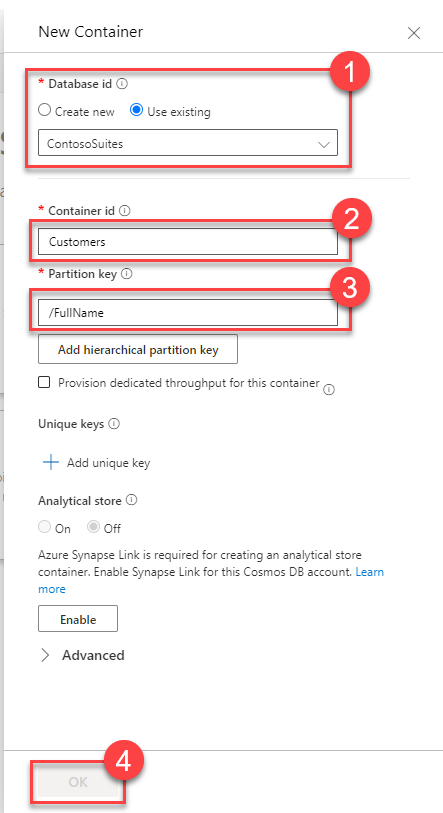

# Task 01 - Create a customer account information API endpoint (20 minutes)

## Introduction

Azure OpenAI has the capacity to parse natural language and facilitate generating API calls through a mechanism known as function calling. Throughout the course of this exercise, you will create an API endpoint and then build the capacity to call this API endpoint based on user prompts.

## Description

In this task, you will load data that Contoso Suites staff has provided to you into Cosmos DB. This data contains a sample of customer account details from their Customer Information System (CIS). From there, they would like you to implement a .NET Web API endpoint exposing this customer information.

The key tasks are as follows:

1. Import the data in Customers.json into a Cosmos DB database named ContosoSuites and a collection named Customers.

    {: .note }
    > The value for DateOfMostRecentStay is in the format yyyy-mm-dd. JSON does not include a native DateTime type, so Cosmos DB stores dates as strings. For date operators like `>` or `<` to work, we need to ensure date values are stored in lexicographic order, so common formats such as mm/dd/yyyy or dd/mm/yyyy would not work.

2. Create a new environment variable on your machine called `AZURE_COSMOS_DB_CONNECTION_STRING`. This should host the connection string for the Cosmos DB resource you have created.

    {: .note }
    > After creating an environment variable, you will need to close and re-open your terminal to refresh the list of environment variables. If you are using Visual Studio Code to run this code base, you may need to close and re-open all open instances of VS Code, as instantiating a new terminal might not refresh the list of environment variables.

3. Using the Web API project **ContosoSuitesWebAPI**, update the stub `GetCustomer()` endpoint to retrieve customer information based on two inputs. The first is a string called `searchCriterion` and may be one of the three following values: **CustomerName**, **LoyaltyTier**, **DateOfMostRecentStay**. The second is a string called `searchValue` and will be what we use to determine relevant documents. There are stub methods in `CosmosService.cs` that will help you implement this customer account lookup endpoint.
4. Run the Web API in debug mode on your machine.
5. Perform a lookup against the Customers collection based on the search criterion and search value, returning all relevant documents. Sample queries include:
   1. **searchCriterion** = `CustomerName` and **searchValue** = `Amber Rodriguez`
   2. **searchCriterion** = `LoyaltyTier` and **searchValue** = `Platinum`
   3. **searchCriterion** = `DateOfMostRecentStay` and **searchValue** = `2023-10-06`

## Success Criteria

- You have created a Cosmos DB collection named Customers.
- You have updated the .NET Web API endpoint to allow querying against the Customers collection.

## Learning Resources

- [Quickstart: Create an Azure Cosmos DB account, database, container, and items from the Azure portal](https://learn.microsoft.com/en-us/azure/cosmos-db/nosql/quickstart-portal)
- [Tutorial: Create a web API with ASP.NET Core](https://learn.microsoft.com/en-us/aspnet/core/tutorials/first-web-api)
- [Configuration in ASP.NET Core](https://learn.microsoft.com/en-us/aspnet/core/fundamentals/configuration/?view=aspnetcore-8.0)
- [Query items in Cosmos DB from .NET](https://learn.microsoft.com/en-us/azure/cosmos-db/nosql/quickstart-dotnet?tabs=try-free&pivots=azd#query-items)
- [cosmos-db-nosql-dotnet-sample-web](https://github.com/Azure-Samples/cosmos-db-nosql-dotnet-sample-web/tree/sample)
- [Tutorial: Develop an ASP.NET web application with Azure Cosmos DB for NoSQL](https://learn.microsoft.com/en-us/azure/cosmos-db/nosql/tutorial-dotnet-web-app)

## Solution

<details>
<summary>Expand this section to view the solution</summary>

- To create the Cosmos DB container, perform the following steps:
  - In the Azure portal, navigate to the Cosmos DB service associated with your resource group.
  - Select the **Data Explorer** option from the top menu.
  - In the Data Explorer, select the **New Container** button in the middle of the screen.
  - Create a new database and give it a name of `ContosoSuites`. You may safely set the database throughput either to `Autoscale` with a Database Max RU/s of `1000`, or `Manual` with a Database RU/s of `400`.
  - The new Container id should be called `Customers`. Choose a partition key, such as `/FullName` and select **OK** to create the database and container.

    

- After container creation finishes, import customer data using the Data Explorer:
  - In the Data menu tree for the NoSQL API left-hand menu, drill into **ContosoSuites**, then **Customer**, and finally select the Items menu option.
  - Choose the **Upload Item** menu option. Navigate to where you have saved the file "Customer.json" and upload it.
  - Uploading will succeed and import 77 entries.

    

- The final code to support customer lookup should look something like this.
  - Here is the code for the four functions in `CosmosService.cs`:

  ```csharp
  public async Task<IEnumerable<Customer>> GetCustomersByName(string name)
      {
          var queryable = container.GetItemLinqQueryable<Customer>();
          using FeedIterator<Customer> feed = queryable
              .Where(c => c.FullName == name)
              .ToFeedIterator<Customer>();
          return await ExecuteQuery(feed);
      }

      public async Task<IEnumerable<Customer>> GetCustomersByLoyaltyTier(string loyaltyTier)
      {
          LoyaltyTier lt = Enum.Parse<LoyaltyTier>(loyaltyTier);
          var queryable = container.GetItemLinqQueryable<Customer>();
          using FeedIterator<Customer> feed = queryable
              .Where(c => c.LoyaltyTier.ToString() == loyaltyTier)
              .ToFeedIterator<Customer>();
          return await ExecuteQuery(feed);
      }

      public async Task<IEnumerable<Customer>> GetCustomersWithStaysAfterDate(DateTime dt)
      {
          var queryable = container.GetItemLinqQueryable<Customer>();
          using FeedIterator<Customer> feed = queryable
              .Where(c => c.DateOfMostRecentStay > dt)
              .ToFeedIterator<Customer>();
          return await ExecuteQuery(feed);
      }

      private async Task<IEnumerable<Customer>> ExecuteQuery(FeedIterator<Customer> feed)
      {
          List<Customer> results = new();
          while (feed.HasMoreResults)
          {
              var response = await feed.ReadNextAsync();
              foreach (Customer c in response)
              {
                  results.Add(c);
              }
          }
          return results;
      }
  ```

  - Here is the code for Program.cs:

  ```csharp
  app.MapGet("/Customer", async (string searchCriterion, string searchValue) => 
  {
      switch (searchCriterion)
      {
          case "CustomerName":
              return await app.Services.GetService<ICosmosService>()!.GetCustomersByName(searchValue);
          case "LoyaltyTier":
              return await app.Services.GetService<ICosmosService>()!.GetCustomersByLoyaltyTier(searchValue);
          case "DateOfMostRecentStay":
              return await app.Services.GetService<ICosmosService>()!.GetCustomersWithStaysAfterDate(DateTime.Parse(searchValue));
          default:
              throw new Exception("Invalid search criterion. Valid search criteria include 'CustomerName', 'LoyaltyTier', and 'DateOfMostRecentStay'.");
      }
  })
  ```

</details>
